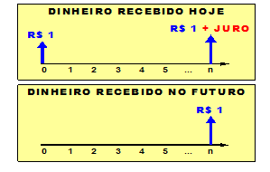

```{r child = "setup.Rmd"}
```

```{r xaringan-tile-view, echo=FALSE}
xaringanExtra::use_tile_view()
```

```{r xaringan-editable, echo=FALSE}
xaringanExtra::use_editable(expires = 1)
```

```{r xaringanExtra-clipboard, echo=FALSE}
htmltools::tagList(
  xaringanExtra::use_clipboard(
    button_text = "<i class=\"fa fa-clipboard\"></i>",
    success_text = "<i class=\"fa fa-check\" style=\"color: #90BE6D\"></i>",
    error_text = "<i class=\"fa fa-times-circle\" style=\"color: #F94144\"></i>"
  ),
  rmarkdown::html_dependency_font_awesome()
)
```

```{r xaringan-fit-screen, echo=FALSE}
xaringanExtra::use_fit_screen()
```

```{r xaringan-extra-styles, echo=FALSE}
xaringanExtra::use_extra_styles(
  hover_code_line = TRUE,         #<<
  mute_unhighlighted_code = TRUE  #<<
)
```

```{r xaringan-scribble, echo=FALSE}
xaringanExtra::use_scribble()
```

## Matemática Financeira

**Juro**
- É a remuneração do capital pelo seu uso alternativo
- Genericamente, todas as formas de remuneração de capital podem ser consideradas um juro

---

## Matemática Financeira


**Taxa de Juros**
- É a razão entre os juros, recebidos ou pagos, no fim de um período de tempo e o capital inicialmente empregado.
 
```{r echo=FALSE, message=FALSE, warning=FALSE, width = "40%"}

```
 
---

## Matemática Financeira

**Juros Simples**

- Somente o capital inicial, conhecido como Principal (P), rende juros num determinado período (n), a uma taxa de juros dada (i).

$$J_n = P \cdot i \cdot n$$
- O montante (M) é a soma do capital inicial mais os juros acumulados ao final do período.
$$M = P + J_n$$
ou

$$M = P(1 + i \cdot n)$$
---

## Matemática Financeira

**Juros Simples**

Um capital de R$10.000,00 foi aplicado por 3 meses, a juros simples. Calcule o valor a ser resgatado no final deste período à taxa de 4% a.m.

.pull-left[
Principal (P): R$ 10.000,00   
Tempo (n): 3 meses   
Taxa (i): 4% ao mês (a.m.)   
Regime: Juros Simples   
]

.pull-right[
J = 10.000 × 0,04 × 3   
J = 10.000 × 0,12   
J = R$ 1.200,00   
M = P + J   
M = 10.000 + 1.200   
M = R$ 11.200,00
]


---

## Matemática Financeira

**Juros Composto**

- Os juros formados a cada período são incorporados ao capital inicial, passando também a produzir juros.

$$J_n = P\times{[(1+i)^n - 1]} $$
- O montante (M) é a soma do capital inicial mais os juros acumulados ao final do período.

$$M = P(1 + i)^n$$

---

## Matemática Financeira

**Juros Composto**

Considere um empréstimo de R$10.000,00 que deve ser resgatado ao final de 3 anos, conjuntamente aos juros acumulados, cuja taxa de juros é de 10% a.a.

.pull-left[
Principal (P): R$ 10.000,00   
Tempo (n): 3 anos   
Taxa (i): 10% ao ano (a.a.)   

$$M = P × (1 + i)^n$$
]

.pull-right[
M = 10.000 × (1 + 0,10)³

M = 10.000 × (1,10)³

M = 10.000 × 1,331

M = R$ 13.310,00
]
---

## Matemática Financeira


**Valor Presente**

- O valor presente, ou valor atual, de uma certa quantia numa data futura é o valor equivalente à quantia em questão na data zero, a uma taxa de juros i.

$$VP = \frac{M}{(1 + i)^n}$$

---

## Matemática Financeira

**Valor Presente**

Determine a quantia que deve ser investida, hoje, de modo a acumular R$100.000,00 em 5 anos, a uma taxa de 10% a.a.

.pull-left[
Montante desejado (M): R$ 100.000,00   
Tempo (n): 5 anos   
Taxa (i): 10% ao ano (a.a.)   
Encontrar: Valor presente (VP)   

$$VP =  \frac{M}{(1 + i)^n}$$
]

.pull-right[

C = 100.000 / (1,10)⁵

C = 100.000 / 1,61051

C = R$ 62.092,13

]
---

## Matemática Financeira

**Série Uniforme de Pagamentos**

- É uma sucessão de recebimentos, desembolsos ou prestações, de mesmo valor, representados por R, divididos regularmente num período de tempo

- Somatório do valor acumulado de vários pagamentos, montante (M), é calculado pela expressão a seguir:

$$M = R \times \frac{(1 + i)^n - 1}{i}$$

---

## Matemática Financeira

**Série Uniforme de Pagamentos**

Uma pessoa deposita anualmente R$5.000,00 numa conta especial particular. Qual será o saldo daqui a 5 anos, para uma remuneração de 8% a.a. concedida pelo banco?

.pull-left[
Depósito anual (R): R$ 5.000,00   
Número de depósitos (n): 5 anos   
Taxa (i): 8% ao ano (a.a.)   
Encontrar: Saldo final (Montante)   
]

.pull-right[
M = 5.000 × [((1,08)⁵ - 1) / 0,08]   
M = R$ 29.333,00 ✓
]

---

## Matemática Financeira

**Série Uniforme de Pagamentos**

-	Procedendo-se o inverso da expressão anterior, pode-se obter o valor de um único pagamento ou prestação R, a partir de montante conhecido, conforme a seguir:

$$R = M \times \frac{i}{(1 + i)^n - 1}$$

---

## Matemática Financeira

**Série Uniforme de Pagamentos**

Determine o valor que deve ser depositado trimestralmente numa conta a prazo fixo, que oferece juros de 7,5% a.t., para acumularmos R$25.000,00 em 2 anos.

.pull-left[
Montante (Valor Futuro): R$ 25.000,00   
Taxa de juros: 7,5% ao trimestre (a.t.)   
Prazo: 2 anos = 8 trimestres
Encontrar: Depósito trimestral (R)

]


.pull-right[
R = 25000 x ((0.75) / ((1,075)^8 - 1))   
R = R$ 2393.00
]


---


## Matemática Financeira

**Série Uniforme de Pagamentos**

Pode-se ainda determinar o valor presente da série uniforme pelo somatório dos valores atuais de cada uma das prestações

$$P = R \times \frac{(1 + i)^{-n}-1}{i \times(1+i)^n}$$
---


## Matemática Financeira

**Série Uniforme de Pagamentos**

Determine o valor à vista de um eletrodoméstico vendido em 6 prestações mensais de R$200,00, sabendo-se que os juros cobrados foram de 6% a.m.

.pull-left[
Prestação mensal (R): R$ 200,00   
Número de prestações (n): 6 meses   
Taxa de juros: 6% ao mês (a.m.)   
Encontrar: Valor à vista (Valor Presente - VP)   

]


.pull-right[

P = 200 × ((1+0,06)^6 - 1) / (0,06 × (1+0,06)^6)   
P = R$ 983,30   
]

---


## Matemática Financeira

**Série Uniforme de Pagamentos**

Para determinação do valor de um pagamento quando o principal é conhecido, inverte-se a expressão anterior

$$R = P \times \frac{i\times(1+i)^n}{(1 + i)^{n}-1}$$
---


## Matemática Financeira

**Série Uniforme de Pagamentos**

Uma pessoa adquire um freezer por R$ 800,00, dando de entrada R$ 300,00. Determine a prestação mensal para um financiamento do restante em 4 meses, à taxa de 5% a.m.

.pull-left[
Preço total do freezer: R$ 800,00   
Entrada: R$ 300,00   
Valor a financiar: R$ 800,00 - R$ 300,00 = R$ 500,00   
Número de prestações (n): 4 meses   
Taxa de juros: 5% ao mês (a.m.)   
Encontrar: Prestação mensal (PMT)   
]

.pull-right[

R = 500 × [0,05 × (1,05)⁴] / [(1,05)⁴ - 1]
R = R$ 141,01
]
---

## Matemática Financeira


**Inflação**

.midi[
- O excesso de moeda na economia gera inflação, que nada mais é que um aumento generalizado e sistemático dos preços face ao aumento da demanda dos bens de consumo e serviços. Já a deflação é caracterizada por um declínio sistemático de preços. (Wannacott e Wannacott, 1986)

- O poder aquisitivo diminui quando existe inflação. Para uma inflação de 50%, num determinado mês, haveria urna perda do poder de compra da moeda de 33%. De fato, se urna mercadoria estivesse custando, no início do mês, R$100,00, passaria a custar, no final do mesmo mês, R$ 150,00, e, desta forma, o poder aquisitivo cairia de 100% para 67% (100/150), ou seja, haveria uma perda de 33%. (Hirschfeld, 1986)

- As **análises econômicas de projetos de investimento não levam em conta a inflação, baseado na premissa de que todos os preços envolvidos são por ela afetados uniformemente.** Desta forma, tais análises são realizadas supondo-se condições estáveis da moeda, já que também seria impossível se prever, com exatidão, as condições futuras.
]

---

## Matemática Financeira

**Correção Monetária**

- A correção monetária, uma invenção brasileira, é uma taxa com o objetivo de tentar recompor o poder aquisitivo dos preços dos bens e serviços atingidos pela inflação, que pode ou não refletir integralmente as taxas de inflação. Um índice de correção monetária relativa a um setor da economia não é necessariamente igual à inflação ocorrida neste mesmo setor.

- A maioria das análises de projetos trabalham com preços constantes, isto é, a partir da suposição de que os preços e custos aumentam conforme as taxas de inflação, sejam elas quais forem, de maneira que seu valor permaneça constante, se expresso em moeda estável.


---

## Matemática Financeira

**Sistema de Amortização**

- Ao contrair um empréstimo ou se recorre a um financiamento, evidentemente, o valor recebido nesta operação, ou seja, o principal, terá que ser restituído à respectiva instituição financeira, acrescido da sua remuneração, que são os juros.

- As formas de devolução do principal mais juros são denominadas de Sistemas de Amortização. Os Sistemas de Amortização mais utilizados são apresentados a seguir, complementados por exemplos numéricos. (Hirschfeld, 1984)

---

## Matemática Financeira

**Sistema Francês de Amortização - PRICE**

- Este sistema também é conhecido corno Sistema PRICE é muito utilizado em todos os setores financeiros, principalmente nas compras a prazo de bens de consumo, através do crédito direto ao consumidor.

- No Sistema PRICE, as prestações são iguais e sucessivas, onde cada prestação é composta por duas parcelas: juros e amortização do capital; cujo cálculo baseia-se numa série uniforme de pagamentos.

---

## Matemática Financeira

Exercício: Calcular os valores das parcelas de juros e amortizações referentes a um empréstimo de R$ 100.000, pelo sistema PRICE, a uma taxa de 5 % a.m. e prazo de 5 meses.

---

## Matemática Financeira

**Sistema de Amortização Constante - SAC**

- Este sistema é muito utilizado em financiamentos internacionais de bancos de desenvolvimento e no sistema financeiro de habitação brasileiro, bem corno em financiamentos de longos prazos.

- As prestações do Sistema SAC são sucessivas e decrescentes em progressão aritmética, cujo valor de cada prestação é composto por uma parcela de juros e outra de amortização constante do capital.

---

## Matemática Financeira

Exercício: Calcular os valores das parcelas de juros e amortizações referentes a um empréstimo de R$ 100.000, pelo sistema SAC, a uma taxa de 5 % a.m. e prazo de 5 meses.


---

## Matemática Financeira

**Sistema de Pagamento Único**

Este é o sistema mais simples e é muito utilizado para financiamentos industriais de capital de giro. O tomador simplesmente paga os juros e amortiza o principal no final do empréstimo.

---
class: center, middle

.huge[
**DÚVIDAS?**
]


